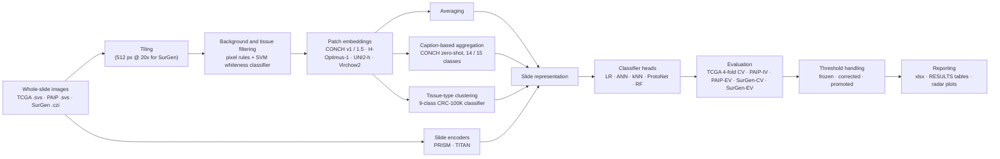

# MSI-H Classification of Colorectal Cancer from Whole-Slide Images

End-to-end pipeline for predicting **microsatellite-instability-high (MSI-H) vs. non-MSI-H** colorectal cancer from H&E whole-slide images (WSIs). It runs from raw slides, through patch extraction and foundation-model embeddings, to slide-level aggregation, five classifier heads, and multi-cohort evaluation. Models are trained on TCGA and validated on two independent cohorts, PAIP and SurGen.

The project compares **how patch embeddings are aggregated into a slide representation** (the main experimental variable) across several pathology foundation models. It also audits the evaluation itself: label provenance, cross-validation leakage, and decision-threshold transfer under domain shift.

> **Start here:** [reports/PROJECT_STATUS.md](reports/PROJECT_STATUS.md) says where the current results live, what is finished and what is left. [reports/EXPERIMENT_LEDGER.md](reports/EXPERIMENT_LEDGER.md) lists every experiment and hyperparameter already tried, with outcomes, so nothing gets repeated.

---

## Highlights

- **Six foundation-model encoders** (CONCH v1, CONCH 1.5, H-Optimus-1, UNI2-h, Virchow2, PRISM) × **four patch-aggregation strategies** (plus the TITAN slide encoder as a baseline) × **five classifier heads** (logistic regression, ANN, kNN, ProtoNet, random forest). The result is one 4-fold CV table plus three external tables.
- **TCGA 4-fold CV (413 slides): best AUROC 0.928** (H-Optimus-1, 15-class caption aggregation, logistic regression). Best balanced accuracy is 0.828 (same encoder/aggregation, ANN).
- **PAIP external validation (TCGA → 78 slides): best AUROC 0.915** [0.83, 0.97] (UNI2, averaging, logistic regression). Best balanced accuracy is 0.896 (UNI2, 14-class caption aggregation, ANN).
- **SurGen external validation (TCGA → 622 slides): best AUROC 0.856** [0.80, 0.91] (UNI2, 15-class caption aggregation, logistic regression). This was run on the earlier 624-slide label set (see [Status](#9-status-and-limitations)).
- **What the comparison supports.** Semantic aggregation beats plain averaging on the external cohorts (SurGen: +0.054 mean AUROC, p < 0.001) but not within TCGA cross-validation (+0.016, p = 0.22): it generalises better, it does not fit better. The configuration TCGA cross-validation selects scores 0.879 on PAIP and 0.740 on SurGen.
- **Evaluation bugs found and fixed.** kNN scores had collapsed to 2–4 distinct values, and thresholds fitted on TCGA did not transfer, leaving 38 of 200 external operating points dead or saturated. One correction rule now applies to every classifier head on both external cohorts and removes all of them; the uncorrected values stay in every result record (see [Data integrity](#4-data-integrity-work)).
- **SurGen label set rebuilt from 624 to 991 slides (822 cases, 100 MSI-H)** by reconciling MMR-IHC and PCR-MSI evidence across the SR386 and SR1482 sub-cohorts. A single master CSV is the source of truth, with a verification script that asserts the counts.
- **Leakage fix.** Case-level folds for SurGen (70 two-slide cases in the earlier 622-slide set) removed patient-level leakage that had inflated earlier SurGen-CV numbers.

---

## 1. Cohorts

| Cohort | Role | Slides (label file → modelled) | Cases | MSI-H |
|---|---|---|---|---|
| **TCGA** | Training; 4-fold CV | 416 → **413** | 413 (1 slide per case) | 60 / 413 (**14.5%**) |
| **PAIP** | External validation (EV); provider train/test split (IV) | 78 → **78** | 78 | 19 / 78 (**24.4%**); split 12/47 train, 7/31 test |
| **SurGen** (earlier label set) | External validation; case-grouped CV | 624 → **622** | 552 | 60 / 622 (**9.6%**) |
| **SurGen** (current label set) | Relabelled; **encoding in progress** | 1020 → **991** labelled | **822** | 100 / 991 (**10.1%**) |

Notes:

- TCGA: three labelled slides have no extracted features and are excluded. Four featured slides have no label.
- SurGen sub-cohorts (current label set): SR386 has 425 slides / 425 cases / 32 MSI-H. SR1482 has 566 slides / 397 cases / 68 MSI-H.
- All SurGen results tables in this README were computed on the **622-slide, 60-MSI-H** set. The 991-slide relabel is finished, but the extra slides are not yet patched or encoded (see Status).
- Patch counts:
  - TCGA: 1,377,933 filtered patches across 417 slides (zero-shot patch statistics table).
  - SurGen (622 modelled slides): 11,870,098 tissue patches.
  - PAIP: 275,541 patches across 78 slides (row count of the 14-class caption table, `classification_results_paip.csv`).
  - Combined total: about 13.5 million patches.

---

## 2. Pipeline architecture



| Stage | Where |
|---|---|
| Tiling, tissue detection, embedding (SurGen, incremental) | [Complete_Pipeline/](Complete_Pipeline/) |
| Slide metadata, patch creation (TCGA/PAIP) | [data_preprocessing/](data_preprocessing/) |
| Background/white-patch SVMs | [data_cleaning/](data_cleaning/) |
| Embedding code | [feature_extraction/](feature_extraction/) |
| Tissue-type classifier (CRC-100K) | [TissueClassifier_CRC100K/](TissueClassifier_CRC100K/) |
| Slide aggregation | [slide_aggregation/](slide_aggregation/) |
| Classifiers, CV/IV/EV runners, threshold modes | [slide_classification/](slide_classification/) |
| Report and plot builders | [tools/](tools/) |

---

## 3. Methods

### Patch extraction and tissue filtering

- **SurGen** ([Complete_Pipeline/](Complete_Pipeline/)): `PATCH_SIZE = 512` at `TARGET_MAG = 20`.
  - Step A-1 computes per-patch RGB statistics.
  - Pixel rules reject near-black patches (black-pixel ratio ≥ 0.20) and near-white patches (white-pixel ratio ≥ 0.90, or mean ≥ 210 with std ≤ 12).
  - Step A-2 passes the remaining patches through an SVM whiteness classifier on `avg_G`, `avg_B` and `std_R`.
  - Step C runs the encoders.
- **TCGA/PAIP** ([data_preprocessing/Patch_creation.ipynb](data_preprocessing/Patch_creation.ipynb)): the notebook switches patch size by magnification (1024 for 40x, otherwise 512). Separate SVMs are trained for TCGA and PAIP background removal ([data_cleaning/](data_cleaning/)).

### Encoders and embedding dimensions

Values are from `MODEL_BASE_DIMS` in [slide_classification/config/paths.py](slide_classification/config/paths.py).

| Encoder | Dim |
|---|---|
| CONCH v1 | 512 |
| CONCH 1.5 | 768 |
| H-Optimus-1 | 1536 |
| UNI2-h | 1536 |
| Virchow2 | 2560 |
| PRISM (slide-level) | 1280 |

TITAN (slide-level, built on CONCH 1.5 patch features) is evaluated as a baseline with a single CONCH 1.5 configuration.

### Slide aggregation

The classifier input is the flattened (rows × dim) matrix (`AGG_MULTIPLIERS` in the same file).

| Strategy | Rows per slide | Idea |
|---|---|---|
| Averaging | 1 | Mean of all patch embeddings |
| Caption-based aggregation | 14 | CONCH zero-shot caption/class assignment of patches into 14 classes; one row per class |
| Caption-based aggregation (15 classes) | 15 | Same, with a 15-class set |
| Tissue-type clustering | 9 | Patches assigned to 9 CRC-100K tissue classes by a trained ANN tissue classifier; one row per class |
| TITAN / PRISM | 1 | Slide-level encoders with no patch aggregation, tabulated separately |

### Classifiers

Grids are in [slide_classification/runners/classifiers.py](slide_classification/runners/classifiers.py).

- **LR:** C = 10, max_iter = 300.
- **kNN:** distance metric selected per configuration (cosine or manhattan), k = 3 in the original grid (changed under the corrected threshold modes, below).
- **ProtoNet:** nearest class prototype.
- **RF:** 500 trees, class weight {0: 1, 1: 10}, prediction threshold 0.3.
- **ANN:** grid over hidden_dim1 ∈ {128, 256, 512} × hidden_dim2 ∈ {64, 128, 256} × max_iter ∈ {500, 1000}. Selection uses validation macro-F1, not test metrics, which was one of the audit fixes.
- **Seeds:** 5 (42–46) for the final external-validation models.

### Cross-validation and external-validation setup

- **TCGA-CV:** 4 folds over 413 slides, each slide tested exactly once, threshold 0.5.
- **PAIP-IV:** the provider's fixed split (47 train / 31 test), with bootstrap 95% CIs.
- **SurGen-CV:** 4 folds built at **case level** (grouped, label-stratified).
- **PAIP-EV and SurGen-EV:** train on **TCGA only**, test on the entire external cohort. Zero external data enter training, hyperparameters or thresholds. Three variants are produced:
  - `tcga_full`: the primary result.
  - `fold_ensemble`: a probability ensemble of the four fold models.
  - `fold_average`: the legacy fold-average convention.
- **Hyperparameters for the final TCGA models** are derived from TCGA-CV alone, by a vote across folds (see `tcga_full_hparams.json`).

### Threshold handling

Implemented in [slide_classification/runners/threshold_modes.py](slide_classification/runners/threshold_modes.py).

| Mode | Behaviour |
|---|---|
| `frozen` (default) | τ_TCGA is fitted by Youden's J on pooled TCGA out-of-fold probabilities and applied unchanged. The strict zero-shot number; the default so every earlier result reproduces exactly. |
| `corrected` | kNN is scored at a larger k with τ refitted on TCGA out-of-fold probabilities **at that k**. Other heads (LR, ANN, ProtoNet, RF) get a rate-matched **quantile threshold**: the target is cut at the (1 − r) quantile, where r is the fraction of TCGA out-of-fold slides flagged positive. |
| `promoted` | The corrected scheme, with its values taking over the headline fields. **This is the published scheme: all five heads, on both external cohorts.** The displaced frozen values are kept under `*_frozen` in the same record, and every row carries a `Threshold_scheme` label. |

- **kNN k = 35** is justified from TCGA alone: it maximised TCGA out-of-fold balanced accuracy (0.6971), and 35 × 0.145 ≈ 5 expected positive neighbours.
- **The same k = 35 is used on both cohorts.** An earlier SurGen table used k = 20, taken from a sweep on SurGen itself; it was replaced on 5 Oct 2026 at a cost of 0.024 mean kNN AUROC on SurGen.
- **AUROC of a corrected row** is the AUROC of the score its threshold is applied to: the k = 35 scores for kNN, and the mean probability of the five seed models for the other heads. For ANN and RF that is a five-seed ensemble, about 0.01–0.03 above the mean of the five single-seed AUROCs. LR and ProtoNet do not vary with the seed.
- The quantile rule reads target **scores** but never target **labels**.

---

## 4. Data-integrity work

### SurGen label reconciliation (624 → 991 slides)

The SurGen release has 1020 WSIs. Labels come from two kinds of evidence: **MMR immunohistochemistry** and **PCR-based MSI testing**.

1. An earlier label set used 624 slides (all of SR386 plus 197 SR1482 slides). In SR1482, 396 slides were unlabelled.
2. An audit against the published train/validate/test split found that **270 SR1482 cases were dropped** because MSI testing was "not performed" or ambiguous. 267 of them had a usable MMR-IHC result, and 3 had an ambiguous MSI value ([reports/surgen_drop_reason_audit.csv](reports/surgen_drop_reason_audit.csv), [reports/surgen_msi_split_reconciliation.csv](reports/surgen_msi_split_reconciliation.csv)).
3. The relabel resolves each slide from whichever evidence is available and records the source and the raw evidence text per row ([Complete_Pipeline/surgen_slide_labels.csv](Complete_Pipeline/surgen_slide_labels.csv)). In the 991 included slides, 850 resolve from MMR-IHC (845 structured, plus 5 free-text reports, 2 of them equivocal and treated as negative) and 141 from PCR-MSI.
4. 29 slides are excluded: 27 with no informative MMR or MSI result, and 2 with zero tissue.
5. **Result: 991 slides, 822 cases, 100 MSI-H / 891 non-MSI-H.** [Complete_Pipeline/verify_surgen_labels.py](Complete_Pipeline/verify_surgen_labels.py) asserts 991 / 100 / 891 and fails otherwise. [Complete_Pipeline/regenerate_surgen_labels.py](Complete_Pipeline/regenerate_surgen_labels.py) keeps the two-column file used by the classifier in lock-step with the master CSV (expected 100 / 891 / 29 excluded).
6. The pipeline only looks labels up; no MMR/MSI rule is re-derived in code.

Cohort accounting for the earlier 622-slide run is in [reports/COHORT_COUNTS.md](reports/COHORT_COUNTS.md) and [reports/surgen_cohort_audit.csv](reports/surgen_cohort_audit.csv).

### Case-level folds (leakage fix)

In the earlier SurGen label set, 70 cases contribute two slides (primary and metastatic), and the old slide-level folds split about 67% of those pairs across train/test. Folds are now case-grouped (0 leaked cases). Through identical code, mean balanced accuracy fell 0.025 and AUROC fell 0.034 across 3 combinations × 5 classifiers, with all 15 balanced-accuracy deltas negative. Earlier SurGen-CV numbers were therefore inflated ([reports/PHASE_2_REPORT.md](reports/PHASE_2_REPORT.md)).

### Evaluation-bug diagnosis

| Finding | Evidence |
|---|---|
| **kNN rank collapse.** At k = 3 a kNN score takes only 2–4 distinct values, so thresholds land inside tied blocks and AUROC is depressed. The in-domain grid was also capped at k ≤ 15. | Mean AUROC over 20 aggregation combinations at k = 3 vs. k = 35: PAIP 0.611 → 0.811; SurGen 0.589 → 0.653 at k = 35 and 0.677 at k = 20. |
| **Stale τ.** A τ fitted at k = 3 is meaningless on k = 35 scores, so a fixed-τ run left dead (all-negative) or saturated (all-positive) operating points. | Refitting τ per k removed every dead threshold at k > 3 on the 40-configuration check (PAIP at k = 50: 7 dead + 3 near-dead → 0). |
| **RF/ProtoNet threshold mismatch.** The frozen τ_TCGA does not transfer to a shifted score distribution. ProtoNet's τ sits near 0.50 on scores that barely cross it. | SurGen: 16 of 21 ProtoNet and 7 of 21 RF configurations were dead or near-dead (frozen baseline). The quantile threshold recovered 84% (ProtoNet) and 74% (RF) of the gap to the oracle threshold. |
| **Detector blind spot.** The old health check only caught zero predicted positives, not saturation. | Added saturated and near-dead/near-saturated (1% band) detection. |

**Keeping the baseline reproducible.** `frozen` stays the runner default, and every corrected record keeps its frozen values beside the published ones, so the strict zero-shot numbers stay reproducible. Diagnostics wrote only derived copies. The published tree was verified byte-identical by SHA-256 before and after, and 16 headline keys × 315 entries showed zero drift ([experiments/surgen_ev_diagnostic/SUMMARY.md](experiments/surgen_ev_diagnostic/SUMMARY.md), [experiments/threshold_and_k/SUMMARY.md](experiments/threshold_and_k/SUMMARY.md); see the note in Status).

Other audit fixes ([reports/](reports/)): ANN hyperparameters are now selected on validation metrics rather than test metrics; a double-softmax in the ANN training graph was removed; unseeded data shuffling that made RF numbers non-reproducible was removed; and missing slides now fail loudly instead of being dropped silently.

---

## 5. Results

Point estimates come from [slide_classification/best_of_all_exps_metric.xlsx](slide_classification/best_of_all_exps_metric.xlsx) (rebuilt 5 Oct 2026). Intervals and tests come from [experiments/final_analysis/](experiments/final_analysis/SUMMARY.md): case-level bootstrap, 2,000 resamples, the same resampled cases for every configuration. Tables cover the aggregation methods; TITAN and PRISM are reported separately. External-validation figures use the primary `tcga_full` variant under the corrected threshold scheme.

### Does aggregation beat averaging?

Difference in mean AUROC over 5 encoders × 5 heads, with 95% interval.

| Contrast | TCGA-CV | PAIP-IV | PAIP-EV | SurGen-CV | SurGen-EV |
|---|---|---|---|---|---|
| Caption-14 − Averaging | +0.024 [−0.005, +0.054] | +0.093 [+0.019, +0.189] | +0.041 [+0.002, +0.081] | +0.046 [+0.022, +0.071] | +0.058 [+0.033, +0.079] |
| Caption-15 − Averaging | +0.011 [−0.017, +0.040] | +0.077 [−0.007, +0.173] | +0.050 [+0.010, +0.088] | +0.052 [+0.026, +0.079] | +0.068 [+0.041, +0.095] |
| Tissue-type clustering − Averaging | +0.013 [−0.011, +0.036] | +0.085 [+0.034, +0.150] | +0.018 [−0.022, +0.059] | +0.022 [−0.001, +0.046] | +0.036 [+0.011, +0.060] |
| Mean of the three − Averaging | +0.016 [−0.010, +0.042] | +0.085 [+0.018, +0.169] | +0.037 [−0.001, +0.074] | +0.040 [+0.019, +0.063] | +0.054 [+0.035, +0.072] |

- On SurGen the advantage is clear for all three methods, in cross-validation and externally (mean of the three: p ≤ 0.001).
- On PAIP external validation the two caption methods are better than averaging (p = 0.04 and 0.02); tissue-type clustering is not.
- Within TCGA cross-validation no aggregation method is significantly better than averaging (p = 0.22).
- The two caption class sets (14 and 15) differ only on the 31-slide PAIP-IV test set, where the 14-class set is slightly ahead (0.016, p = 0.02).

Mean AUROC by aggregation method (5 encoders × 5 heads):

| Method | TCGA-CV | PAIP-IV | PAIP-EV | SurGen-CV | SurGen-EV |
|---|---|---|---|---|---|
| Averaging | 0.775 | 0.760 | 0.819 | 0.665 | 0.662 |
| Caption-14 | 0.802 | 0.853 | 0.861 | 0.711 | 0.720 |
| Caption-15 | 0.792 | 0.837 | 0.869 | 0.718 | 0.730 |
| Tissue-type clustering | 0.794 | 0.845 | 0.838 | 0.686 | 0.697 |

### The configuration TCGA cross-validation selects

TCGA-CV selects H-Optimus-1 · Caption-15 · LR (AUROC 0.928 [0.887, 0.960]). Applied unchanged to the external cohorts:

| Cohort | AUROC [95% CI] | Rank among 100 | Balanced accuracy [95% CI] | Sensitivity / specificity | Gap to the best configuration |
|---|---|---|---|---|---|
| PAIP-EV | 0.879 [0.733, 0.984] | 19 | 0.799 [0.685, 0.904] | 0.63 / 0.97 | 0.037 [−0.038, +0.125] |
| SurGen-EV | 0.740 [0.652, 0.821] | 32 | 0.688 [0.621, 0.758] | 0.52 / 0.86 | 0.116 [+0.050, +0.184] |

This is the unbiased external estimate. On PAIP it cannot be distinguished from the best configuration; on SurGen it is clearly below it. The TCGA ranking transfers only moderately (Spearman 0.58 with PAIP-EV and 0.50 with SurGen-EV over the 100 configurations).

### Best of 100 configurations per experiment

These are maxima over 100 configurations chosen on the data they are reported on, so they are optimistic, and their intervals do not account for the selection.

| Experiment | N | Best AUROC [95% CI] | Configuration | Best BalAcc | Configuration |
|---|---|---|---|---|---|
| TCGA-CV | 413 | **0.928** [0.887, 0.960] | H-Optimus-1 · Caption-15 · LR | **0.828** | H-Optimus-1 · Caption-15 · ANN |
| PAIP-IV (31 test) | 31 | 0.926 [0.774, 1.000] | CONCH 1.5 · Caption-15 · kNN | 0.908 | CONCH 1.5 · Caption-15 / TTC · kNN |
| PAIP-EV | 78 | **0.915** [0.829, 0.974] | UNI2 · Averaging · LR | **0.896** [0.800, 0.975] | UNI2 · Caption-14 · ANN |
| SurGen-CV (case-grouped) | 622 | 0.853 [0.799, 0.896] | UNI2 · Caption-15 · RF | 0.733 | UNI2 · Caption-15 · ANN |
| SurGen-EV | 622 | **0.856** [0.800, 0.905] | UNI2 · Caption-15 · LR | 0.781 [0.715, 0.842] | UNI2 · Caption-14 · LR |

PAIP-IV has only 31 test slides (7 MSI-H), so one slide moves balanced accuracy by about 0.07. For the two cross-validation rows the point estimate is the mean of the four fold AUROCs and the interval is for the pooled out-of-fold AUROC, which differs by a few thousandths.

### Best AUROC per encoder (any aggregation × classifier)

| Encoder | TCGA-CV | PAIP-EV | SurGen-EV |
|---|---|---|---|
| H-Optimus-1 | **0.928** | 0.902 | 0.814 |
| UNI2-h | 0.894 | **0.915** | **0.856** |
| Virchow2 | 0.881 | 0.910 | 0.784 |
| CONCH 1.5 | 0.839 | 0.883 | 0.721 |
| CONCH v1 | 0.817 | 0.872 | 0.739 |

Averaged over all aggregation methods and heads, H-Optimus-1 is the best encoder within TCGA (by 0.06 to 0.12 mean AUROC, p < 0.001) and UNI2-h is the best on SurGen (by 0.05 to 0.15, p ≤ 0.001). On PAIP-EV the top three encoders cannot be distinguished.

### Mean AUROC by classifier head (TCGA-CV, PAIP-EV and SurGen-EV, aggregation methods)

| Head | TCGA-CV | PAIP-EV | SurGen-EV |
|---|---|---|---|
| LR | 0.850 | 0.872 | 0.709 |
| ANN | 0.845 | 0.864 | 0.737 |
| RF | 0.845 | 0.836 | 0.703 |
| ProtoNet | 0.720 | 0.850 | 0.710 |
| kNN | 0.694 | 0.811 | 0.653 |

The two external columns use the corrected scheme with the same settings on both cohorts: kNN at k = 35, and for ANN and RF the AUROC of the five-seed mean probability. The TCGA-CV column is the grid-searched kNN (mostly k = 3) and single-seed models.

### Effect of the threshold correction (`tcga_full`, mean over 20 aggregation combinations)

| Cohort | Head | AUROC before → after | BalAcc before → after | Dead or saturated thresholds before → after |
|---|---|---|---|---|
| PAIP-EV | LR | 0.872 → 0.872 | 0.743 → 0.789 | 0 → 0 |
| PAIP-EV | ANN | 0.850 → 0.864 | 0.750 → 0.814 | 0 → 0 |
| PAIP-EV | ProtoNet | 0.850 → 0.850 | 0.727 → 0.794 | 3 → 0 |
| PAIP-EV | RF | 0.825 → 0.836 | 0.662 → 0.772 | 3 → 0 |
| PAIP-EV | kNN (k = 3 → 35) | 0.611 → 0.811 | 0.596 → 0.703 | 2 → 0 |
| SurGen-EV | LR | 0.709 → 0.709 | 0.594 → 0.649 | 4 → 0 |
| SurGen-EV | ANN | 0.714 → 0.737 | 0.581 → 0.672 | 2 → 0 |
| SurGen-EV | ProtoNet | 0.710 → 0.710 | 0.523 → 0.653 | 16 → 0 |
| SurGen-EV | RF | 0.669 → 0.703 | 0.558 → 0.642 | 8 → 0 |
| SurGen-EV | kNN (k = 3 → 35) | 0.589 → 0.653 | 0.565 → 0.571 | 0 → 0 |

"Before" is the frozen τ_TCGA with single-seed AUROCs averaged over five seeds. The quantile threshold moves only the cut point, so LR and ProtoNet keep their AUROC; ANN and RF gain from averaging five seeds into one prediction; kNN gains from the larger neighbourhood. kNN stays weak on SurGen at any k (sensitivity 0.85, specificity 0.30).

### Slide-level encoder baselines

PRISM (TCGA-CV): best AUROC 0.869 (ANN). TITAN on CONCH 1.5 features (TCGA-CV): best AUROC 0.877 (RF). Both are below the best aggregated configuration (0.928). The comparison on equal terms is less favourable: on the same CONCH 1.5 patch features, TITAN is better than the four aggregation methods by 0.085 mean AUROC in TCGA-CV, 0.057 in SurGen-CV and 0.066 in SurGen-EV. The aggregation methods overtake TITAN only when paired with a stronger patch encoder. PRISM has not been evaluated on SurGen (two of its 622 embeddings need regenerating). See the `*_TITAN_PRISM` sheets of the workbook.

### Figures

Radar plots (spokes are aggregation × classifier; one line per encoder; radius fixed at 0–1). Generated by [tools/make_radar_plots.py](tools/make_radar_plots.py).

| | AUROC | Balanced accuracy |
|---|---|---|
| TCGA-CV | [radar](Analysis_and_Visualization/Radar_Plots/TCGA-CV/TCGA-CV_AUROC_radar.png) | [radar](Analysis_and_Visualization/Radar_Plots/TCGA-CV/TCGA-CV_BalAcc_radar.png) |
| PAIP-EV | [radar](Analysis_and_Visualization/Radar_Plots/PAIP-EV/PAIP-EV_AUROC_radar.png) | [radar](Analysis_and_Visualization/Radar_Plots/PAIP-EV/PAIP-EV_BalAcc_radar.png) |
| SurGen-EV | [radar](Analysis_and_Visualization/Radar_Plots/SurGen-EV/SurGen-EV_AUROC_radar.png) | [radar](Analysis_and_Visualization/Radar_Plots/SurGen-EV/SurGen-EV_BalAcc_radar.png) |

These figures are drawn from the current workbook (5 Oct 2026).


---

## 6. Repository structure

```text
Complete_Pipeline/        SurGen end-to-end pipeline: download -> tiling -> tissue filter -> embeddings (per-encoder runners),
                          label master CSV (surgen_slide_labels.csv), label verification/regeneration scripts
data_preprocessing/       TCGA/PAIP slide metadata and patch creation notebooks
data_cleaning/            Background / white-patch SVM training (TCGA, PAIP)
feature_extraction/       Encoder wrappers and dataset modules
TissueClassifier_CRC100K/ 9-class tissue classifiers trained on CRC-100K (per-encoder params and metrics)
slide_aggregation/        Averaging, caption-based (CONCH zero-shot), tissue-type clustering, TITAN
slide_classification/     Classifiers, data layer, CV/IV/EV runners, threshold modes, results trees, metric workbook
  config/paths.py         Machine-keyed data roots, encoder dims, aggregation row counts
  runners/                cv_runner, iv_runner, ev_runner, full_trainer, classifiers, thresholds, threshold_modes
tools/                    Report, workbook, radar-plot, t-SNE and audit builders
experiments/              Threshold and k studies, external-validation diagnostics, final analysis (intervals, paired tests)
reports/                  Phase reports (audit and remediation), cohort accounting, SurGen audit CSVs
Analysis_and_Visualization/  Radar plots, zero-shot and t-SNE shift statistics, classifier comparisons
```

---

## 7. Reproducing

**Requirements.** Python 3.10 (conda). The classification results were produced with scikit-learn 1.7.0 and PyTorch 2.2.0; use the same scikit-learn version to load the saved models. [Complete_Pipeline/requirements.txt](Complete_Pipeline/requirements.txt) lists the pinned stack (PyTorch 2.11, timm, scikit-learn 1.8, pandas, pylibCZIrw for SurGen `.czi` slides). A CUDA GPU is needed for encoding. The foundation-model checkpoints are gated on Hugging Face, so set `HF_TOKEN` (via environment or a local `.env`; never committed). Raw slides and checkpoints are **not** included in this repository.

**Data roots.** All data paths come from [slide_classification/config/paths.py](slide_classification/config/paths.py), selected by the `MACHINE` environment variable (`local` by default). Edit the roots there to point at your own copy of the data.

**1. Encode SurGen slides** (Windows/CZI pipeline; supervised, resumable):

```bash
python Complete_Pipeline/verify_surgen_labels.py          # asserts 991 / 100 / 891
python Complete_Pipeline/run_pipeline_supervisor.py       # runs the v6 batch pipeline
```

> **Warning - these runners overwrite or move results.** Read this before running anything on a copy that holds results you care about.
> - Every runner renames the existing results tree to `<name>_ARCHIVED_<date>` before it writes. Those archive folders are git-ignored, so git will not show the move. Pass `--no-archive` to leave the tree in place.
> - `cv_runner.py --experiment TCGA-CV --force` retrains TCGA and rewrites `thresholds_TCGA.json`, which every external-validation number depends on.
> - SurGen runs skip any encoder whose feature folder is missing instead of failing, so check that all five encoder folders exist under `surgen_data/surgen_processed/` first.

**2. Classification and evaluation** (run from `slide_classification/`):

```bash
python runners/cv_runner.py --experiment TCGA-CV          # or SurGen-CV
python runners/iv_runner.py --ann-protocol full --ann-preset ann_old   # PAIP provider split, published ANN
python runners/full_trainer.py                            # final TCGA models, 5 seeds
python runners/ev_runner.py --experiment PAIP-EV --threshold-mode promoted   # published scheme; same for SurGen-EV
python runners/ev_runner.py --experiment PAIP-EV          # frozen tau_TCGA only (strict zero-shot)
```

Common flags: `--methods`, `--models`, `--classifiers`, `--force`. The `ev_runner` also takes `--variants`, `--seeds` and `--knn-k`.

**3. Reporting:**

```bash
python tools/build_report.py             # writes best_of_all_exps_metric.xlsx
python tools/make_radar_plots.py         # radar figures
python tools/write_results_md.py         # RESULTS.md tables
```

**4. Intervals and tests** (reads the saved models and stored predictions; changes no result tree):

```bash
python experiments/final_analysis/01_uniform_ev_scores.py         # per-slide external scores
python experiments/final_analysis/validate_against_published.py   # must agree with the result trees
python experiments/final_analysis/02_uncertainty.py               # bootstrap intervals, paired contrasts
```

Treat the sequence above as a guide: it reflects the entry points that exist in the code, but a full end-to-end re-run has not been verified from a clean checkout [TBD: confirm on a clean machine].

---

## 8. Tech stack

Python · PyTorch · timm · scikit-learn · pandas / NumPy · pylibCZIrw (CZI reading) · OpenCV · Hugging Face Hub (gated model weights) · matplotlib (reporting) · Jupyter.

Foundation models: CONCH / CONCH 1.5, H-Optimus-1, UNI2-h, Virchow2, PRISM, TITAN.

---

## 9. Status and limitations

- **SurGen is only partly encoded under the new labels.** 991 slides are labelled, but features exist for 622 (11,870,098 patches). The remaining 369 slides are not yet patched or encoded, which means **all SurGen results here are on the earlier 622-slide, 60-MSI-H set** and have not been re-run on the 991-slide labels. SurGen results will change when they are.
- **Published-benchmark match is not verified here.** [TBD: cite the published SurGen benchmark and its label/case counts to confirm 991 / 822 matches it.] The only comparison on file is the earlier-label audit against the published split.
- **The 622-slide results remain valid under the new labels.** None of the 622 modelled slides changed label in the relabel (562 non-MSI-H / 60 MSI-H in both files). The relabel only adds 369 slides, 40 of them MSI-H.
- **Uncertainty.** Case-level bootstrap intervals and paired tests for every configuration are in [experiments/final_analysis/](experiments/final_analysis/SUMMARY.md); the workbook carries point estimates only. Cross-validation is a single seed, and PAIP-IV's 31-slide test set is very small.
- **Chosen configurations are optimistic.** The "best" rows above are maxima over 100+ configurations per experiment, selected on the same results they are reported from. Use them as a ranking aid, not as an unbiased performance estimate. The unselected mean-by-head tables are the safer summary.
- **The aggregation advantage is external, not internal.** Within TCGA cross-validation no aggregation method is significantly better than averaging (+0.016 mean AUROC, p = 0.22). The supportable claim is better generalisation.
- **The quantile threshold uses unlabelled target scores** (like unsupervised domain adaptation), not labels. It is not a strict zero-shot setting.
- **SurGen performance is modest.** The configuration TCGA selects reaches 0.740 there, and kNN is weak on SurGen at any neighbourhood size.
- **TITAN is evaluated on a single encoder** (CONCH 1.5), and PRISM does not appear in the SurGen result tables. PRISM embeddings now exist for all 622 SurGen slides but have not been classified; five of them were built from slides with missing tiles and need regenerating first.
- **CIMP/BRAF/KRAS/TP53 label files exist, but only the MSI-H task is evaluated.**
- **Repository state.** `RESULTS.md` is generated: its tables match the workbook, but some of its hard-coded prose is out of date (it still says PAIP has 73 slides). Radar PNGs are git-ignored by default; the links resolve locally but not on GitHub unless the images are force-added. Superseded snapshots, old reports and test outputs were moved out of the repository in October 2026 (see [reports/PROJECT_STATUS.md](reports/PROJECT_STATUS.md)).
- **Data and compute.** Raw slides (TCGA, PAIP, SurGen), the embeddings and the model weights are not redistributed. Each cohort has its own access terms.
